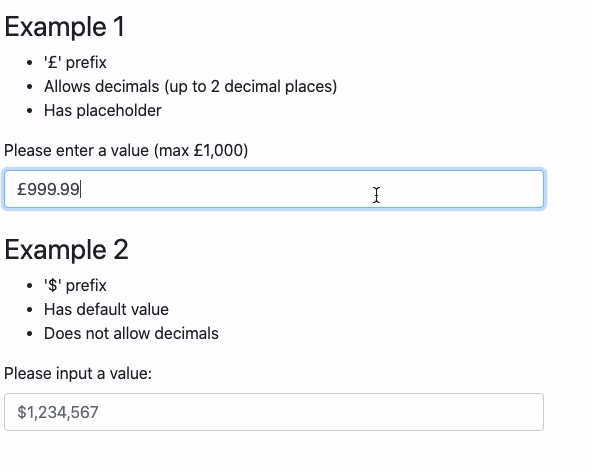

# React Currency Input Field Component

[](https://www.npmjs.com/package/react-currency-input-field) [](https://www.npmjs.com/package/react-currency-input-field)
[](https://www.npmjs.com/package/react-currency-input-field) [](https://codecov.io/gh/cchanxzy/react-currency-input-field/) [](https://github.com/cchanxzy/react-currency-input-field/actions?query=workflow%3ARelease)

- [React Currency Input Field Component](#react-currency-input-field-component)
  - [Features](#features)
  - [Examples](#examples)
  - [Install](#install)
  - [Usage](#usage)
  - [Props](#props)
    - [onValueChange](#onvaluechange)
      - [value](#value)
      - [name](#name)
      - [values](#values)
    - [Abbreviations](#abbreviations)
    - [Prefix and Suffix](#prefix-and-suffix)
    - [Separators](#separators)
    - [Intl Locale Config](#intl-locale-config)
    - [Decimal Scale and Decimals Limit](#decimal-scale-and-decimals-limit)
    - [Fixed Decimal Length](#fixed-decimal-length)
  - [Format values for display](#format-values-for-display)
  - [v3.0.0 Release Notes](#v300-release-notes)
    - [Breaking Changes](#breaking-changes)
    - [Improvements in v3](#improvements-in-v3)
    - [Reasoning](#reasoning)
  - [Issues](#issues)
  - [Contributing](#contributing)
  - [Support this Project](#support-this-project)
  - [v4.0.0-alpha Announcement](#v400-alpha-announcement)

## Features

- Allows [abbreviations](#abbreviations) eg. 1k = 1,000 2.5m = 2,500,000
- Prefix and Suffix options eg. £ or \$
- Automatically inserts [group separator](#separators)
- Accepts [Intl locale config](#intl-locale-config)
- Can use arrow down/up to step
- Can allow/disallow decimals
- Written in TypeScript and has type support
- Does not use any third party packages

## Examples

[Play with demo](https://cchanxzy.github.io/react-currency-input-field) or view [examples code](https://github.com/cchanxzy/react-currency-input-field/blob/main/src/examples)

[](https://cchanxzy.github.io/react-currency-input-field)

## Install

`npm install react-currency-input-field`

or

`yarn add react-currency-input-field`

## Usage

```js
import CurrencyInput from 'react-currency-input-field';

<CurrencyInput
  id="input-example"
  name="input-name"
  placeholder="Please enter a number"
  defaultValue={1000}
  decimalsLimit={2}
  onValueChange={(value, name, values) => console.log(value, name, values)}
/>;
```

Have a look in [`src/examples`](https://github.com/cchanxzy/react-currency-input-field/tree/main/src/examples) for more examples on implementing and validation.

## Props

| Name                                               | Type       | Default        | Description                                                                                    |
| -------------------------------------------------- | ---------- | -------------- | ---------------------------------------------------------------------------------------------- |
| allowDecimals                                      | `boolean`  | `true`         | Allow decimals                                                                                 |
| allowNegativeValue                                 | `boolean`  | `true`         | Allow user to enter negative value                                                             |
| defaultValue                                       | `number`   |                | Default value                                                                                  |
| value                                              | `number`   |                | Programmatically set the value                                                                 |
| [onValueChange](#onvaluechange)                    | `function` |                | Handle change in value                                                                         |
| placeholder                                        | `string`   |                | Placeholder if no value                                                                        |
| [decimalsLimit](#decimal-scale-and-decimals-limit) | `number`   | `2`            | Limit length of decimals allowed                                                               |
| [decimalScale](#decimal-scale-and-decimals-limit)  | `number`   |                | Specify decimal scale for padding/trimming eg. 1.5 -> 1.50 or 1.234 -> 1.23 if decimal scale 2 |
| [fixedDecimalLength](#fixed-decimal-length)        | `number`   |                | Value will always have the specified length of decimals                                        |
| [prefix](#prefix-and-suffix)                       | `string`   |                | Include a prefix eg. £ or \$                                                                   |
| [suffix](#prefix-and-suffix)                       | `string`   |                | Include a suffix eg. € or %                                                                    |
| [decimalSeparator](#separators)                    | `string`   | locale default | Separator between integer part and fractional part of value                                    |
| [groupSeparator](#separators)                      | `string`   | locale default | Separator between thousand, million and billion                                                |
| [intlConfig](#intl-locale-config)                  | `object`   |                | International locale config                                                                    |
| disabled                                           | `boolean`  | `false`        | Disabled                                                                                       |
| disableAbbreviations                               | `boolean`  | `false`        | Disable abbreviations eg. 1k -> 1,000, 2m -> 2,000,000                                         |
| [disableGroupSeparators](#separators)              | `boolean`  | `false`        | Disable auto adding the group separator between values, eg. 1000 -> 1,000                      |
| maxLength                                          | `number`   |                | Maximum characters the user can enter                                                          |
| step                                               | `number`   |                | Incremental value change on arrow down and arrow up key press                                  |
| transformRawValue                                  | `function` |                | Transform the raw value from the input before parsing. Needs to return `string`.               |

### onValueChange

Handle changes to the value.

```js
onValueChange = (value, name, values) => void;
```

#### value

`value` will give you the value in a string format, without the prefix/suffix/separators.

Example: `£123,456 -> 123456`

#### name

`name` is the name you have passed to your component

#### values

`values` gives an object with three key values:

- `float`: Value as float or null if empty. Example: "1.99" > 1.99
- `formatted`: Value after applying formatting. Example: "1000000" > "1,000,0000"
- `value`: Non formatted value as string, ie. same as first param.

### Abbreviations

It can parse values with abbreviations `k`, `m` and `b`

Examples:

- 1k = 1,000
- 2.5m = 2,500,000
- 3.456B = 3,456,000,000

This can be turned off by passing in `disableAbbreviations`.

### Prefix and Suffix

You can add a prefix or suffix by passing in `prefix` or `suffix`.

```js
import CurrencyInput from 'react-currency-input-field';

<CurrencyInput prefix="£" value={123} />;
// £123

<CurrencyInput suffix="%" value={456} />;
// 456%
```

Note: Passing in prefix/suffix will override the intl locale config.

### Separators

You can change the decimal and group separators by passing in `decimalSeparator` and `groupSeparator`.

Example:

```js
import CurrencyInput from 'react-currency-input-field';

<CurrencyInput decimalSeparator="," groupSeparator="." />;
```

Note: the separators cannot be a number, and `decimalSeparator` must be different to `groupSeparator`.

To turn off auto adding the group separator, add `disableGroupSeparators={true}`.

### Intl Locale Config

This component can also accept international locale config to format the currency to locale setting.

Examples:

```javascript
import CurrencyInput from 'react-currency-input-field';

<CurrencyInput intlConfig={{ locale: 'en-US', currency: 'GBP' }} />;

<CurrencyInput intlConfig={{ locale: 'ja-JP', currency: 'JPY' }} />;

<CurrencyInput intlConfig={{ locale: 'en-IN', currency: 'INR' }} />;
```

`locale` should be a [BCP 47 language tag](https://developer.mozilla.org/en-US/docs/Web/JavaScript/Reference/Global_Objects/Intl#Locale_identification_and_negotiation), such as "en-US" or "en-IN".

`currency` should be a [ISO 4217 currency code](https://en.wikipedia.org/wiki/ISO_4217), such as "USD" for the US dollar, "EUR" for the euro, or "CNY" for the Chinese RMB.

Any prefix, suffix, group separator and decimal separator options passed in will override the default locale settings.

### Decimal Scale and Decimals Limit

`decimalsLimit` and `decimalScale` sound similar but have different usages.

`decimalsLimit` prevents the user from typing more than the limit, and `decimalScale` will format the decimals `onBlur` to the specified length, padding or trimming as necessary.

Example:

```md
If decimalScale is 2

- 1.5 becomes 1.50 (padded)
- 1.234 becomes 1.23 (trimmed)

---

If decimalLimit is 2

- User enters 1.23
- User is then prevented from entering another value
```

### Fixed Decimal Length

Use `fixedDecimalLength` so that the value will always have the specified length of decimals.

This formatting happens onBlur.

Example if `fixedDecimalLength` was 2:

```md
- 1 -> 1.00
- 123 -> 1.23
- 12.3 -> 12.30
- 12.34 -> 12.34
```

## Format values for display

Use the `formatValue` function to format the values to a more user friendly string. This is useful if you are displaying the value somewhere else ie. the total of multiple inputs.

```javascript
import { formatValue } from 'react-currency-input-field';

// Format using prefix, groupSeparator and decimalSeparator
const formattedValue1 = formatValue({
  value: '123456',
  groupSeparator: ',',
  decimalSeparator: '.',
  prefix: '$',
});

console.log(formattedValue1);
// $123,456

// Format using intl locale config
const formattedValue2 = formatValue({
  value: '500000',
  intlConfig: { locale: 'en-IN', currency: 'INR' },
});

console.log(formattedValue2);
// ₹5,00,000
```

## v3.0.0 Release Notes

### Breaking Changes

- :warning: `onChange` renamed to `onValueChange` :warning:
- `onBlurValue` has been removed.
- `turnOffAbbreviations` renamed to `disableAbbreviations`.
- `turnOffSeparators` renamed to `disableGroupSeparators`.
- `precision` renamed to `decimalScale`

### Improvements in v3

- [Intl locale config](#intl-locale-config) can be passed in. _Please note: formatting where the currency symbol is placed after the value like a suffix eg. (1 234,56 €) might cause problems, this is still in development._
- Group separator will default to browser locale if not specified.
- Can pass `ref` to the component.
- `onChange` and `onBlur` functions can be passed in and will be called with original event.

### Reasoning

As this component grew in usage, I started getting more bug reports and feature requests. That wasn't a problem though, because I was always happy to fix any bugs and implement any features if I could.

However, this meant sometimes I was a bit trigger happy, and didn't always think about how the different options interacted with each other. I found that it was getting a bit convoluted for my liking, and choices I had made earlier in development, now seemed like it could be improved.

Therefore, I took the opportunity of v3 to do a bit of tidying up for the component, in order to make it more future proof and intuitive to use.

I apologize if any of the changes cause new bugs or issues. Please let me know and I will fix asap.

## Issues

Feel free to raise an issue on Github if you find a bug or have a feature request.

## Contributing

If you would like to contribute to this repository, please refer to the [contributing doc](https://github.com/cchanxzy/react-currency-input-field/blob/main/docs/CONTRIBUTING.md).

## Support this Project

If you'd like to support this project, please refer to the [support doc](https://github.com/cchanxzy/react-currency-input-field/blob/main/docs/SUPPORT.md).

## v4.0.0-alpha Announcement

I'm excited to announce the release of **[v4.0.0-alpha.1](https://www.npmjs.com/package/react-currency-input-field/v/4.0.0-alpha.1)**.

This marks the beginning of development for version 4.0.0, and the first improvement is a significant reduction in bundle size, going from ~26KB to ~7KB.

For more information, please refer to the [announcement post](https://github.com/cchanxzy/react-currency-input-field/blob/main/docs/v4.0.0-alpha-annoucement.md).

If you would like to try out the alpha version, you can install it using the following command:

```bash
npm install react-currency-input-field@alpha

yarn add react-currency-input-field@alpha

pnpm add react-currency-input-field@alpha
```

Please note that this version is still in development and may contain bugs or incomplete features.

**Use it at your own risk!**
