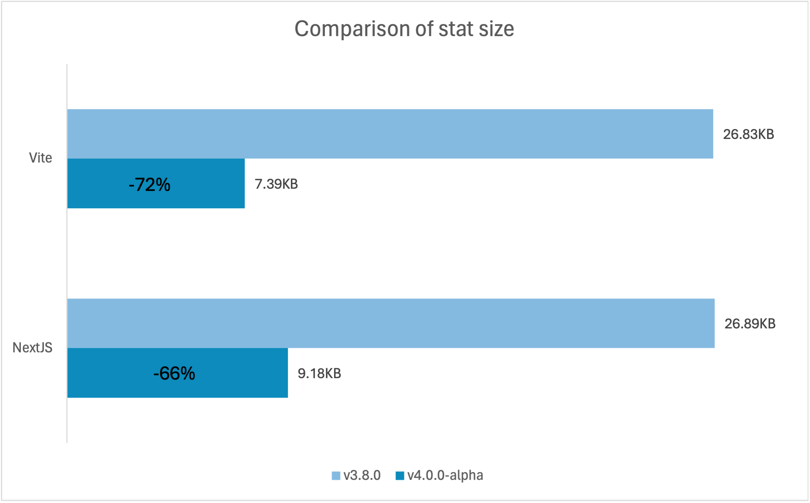
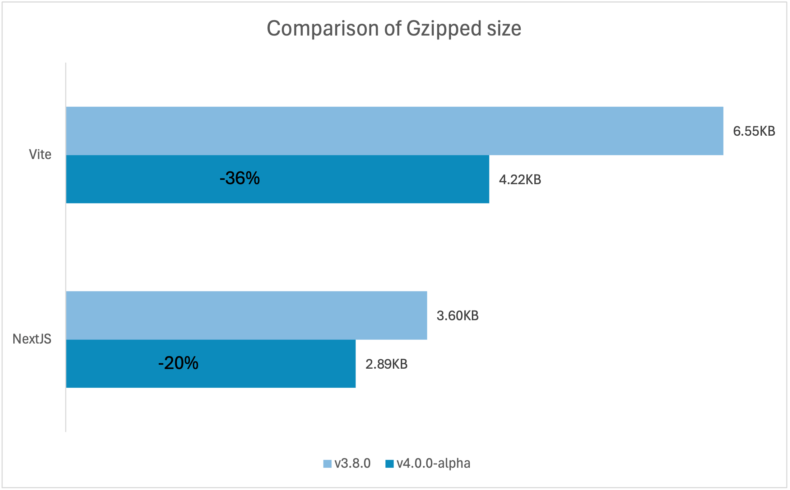
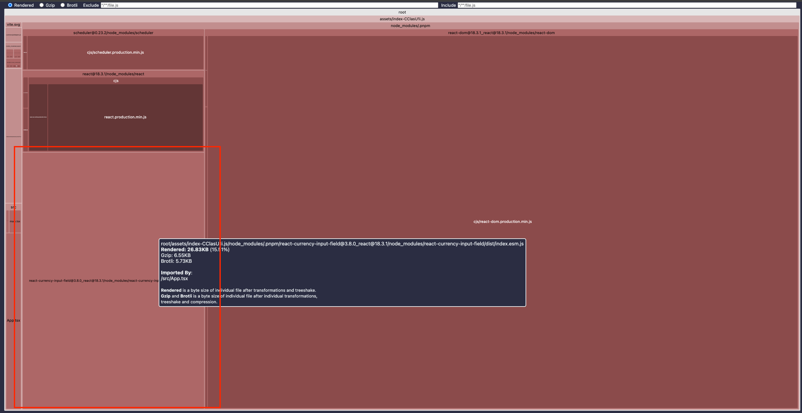
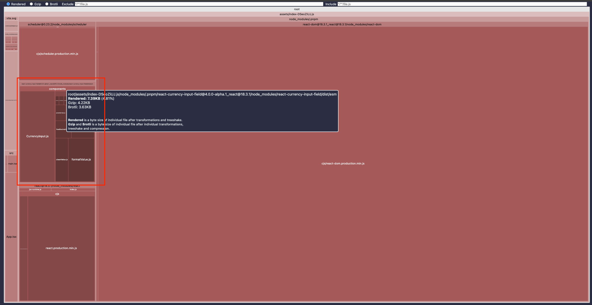

# Announcing React Currency Input Field v4.0.0-alpha 🎉

I'm excited to announce the release of **v4.0.0-alpha.1** for [react-currency-input-field](https://www.npmjs.com/package/react-currency-input-field)! This marks the beginning of development for version 4.0.0, and I'd like to share some of the significant updates included in this alpha version.

- [Announcing React Currency Input Field v4.0.0-alpha 🎉](#announcing-react-currency-input-field-v400-alpha-)
  - [Why v4?](#why-v4)
  - [What's New So Far?](#whats-new-so-far)
    - [1. Build Process Overhaul](#1-build-process-overhaul)
    - [2. Development Tools Update](#2-development-tools-update)
  - [Benefits of the New Build Process](#benefits-of-the-new-build-process)
    - [Benchmarks](#benchmarks)
    - [Better Treemap visibility](#better-treemap-visibility)
  - [Alpha Release: What to Expect](#alpha-release-what-to-expect)
  - [When Will v4 Be Stable?](#when-will-v4-be-stable)
  - [How to Install](#how-to-install)
  - [Feedback Welcome](#feedback-welcome)
  - [Support the Project](#support-the-project)

## Why v4?

Version 3.0.0 of this package was released four years ago, marking a significant milestone in its development. Since then, we've seen many minor updates that have maintained the stability and reliability of the package.

This stability has been both a strength and a limitation. On the one hand, users have enjoyed a dependable tool. On the other hand, the landscape of React and JavaScript has evolved during this time, with new patterns, tools, and performance optimizations becoming the norm.

It's time for this package to evolve as well. The goal is to modernize and optimize it to meet the demands of today's development environment, ensuring it remains efficient, lightweight, and aligned with current best practices.

## What's New So Far?

### 1. Build Process Overhaul

- **Switched from Rollup to esbuild**  
  This component is now built and compiled using esbuild, leading to a much simpler and more efficient build process.

- **Dropped UMD Build**  
  To reduce complexity, the UMD build is no longer exported. The package now only exports **CJS** and **ESM** builds.

- **Minified Build**
  The new build is now minified, resulting in smaller file sizes and faster load times. See the [benchmark](#benchmarks) for comparison.

- **Improved Treeshaking**  
  The new build supports better treeshaking, allowing unused code to be excluded from your bundles. This results in optimized performance and smaller final builds for your projects.

- **[Enhanced Visibility with Treemaps](#better-treemap-visibility)**  
  Since the new build is not bundled, you'll now have the ability to analyze the treemap for the package's functions, giving you better insight into what’s included in your bundle.

### 2. Development Tools Update

- **Moved from Yarn to pnpm**  
  Development dependencies are now managed with pnpm, providing better performance and disk space savings.

## Benefits of the New Build Process

One of the most exciting outcomes of this change is a **dramatic reduction in bundle size**:

- Previous size: **~26KB**
- New size: **~7KB**

That's roughly a **70% reduction**! 🚀

This improvement translates to quicker load times and lower memory usage for your projects.

### Benchmarks

The following benchmarks highlight the reduction in bundle size.

Bundle size comparison between a Vite project and a Next.js project using bundler analyzers:



Comparing the Gzipped sizes:


### Better Treemap visibility

As you can see below, you are now able to analyze the treemap for the package's functions, giving you better insight into what’s included in your bundle.

Before, you could only see the top level package in the treemap:


Now, you can see the individual functions in the treemap:


## Alpha Release: What to Expect

As this is an alpha version, there might be changes to the package structure and API before the stable release.

I'm taking this opportunity to:

- Review the current API: Does it still make sense? Can it be improved or simplified?
- Gather feedback from the community.
- Ensure the package meets modern best practices.

I want to ensure any necessary breaking changes are made in this release to avoid frequent major version updates, as that’s never fun for anyone.

## When Will v4 Be Stable?

Honestly? **I’m not sure yet**. It will depend entirely on how much time I can spare inbetween work, life and social commitments. Rest assured, I’ll keep you updated as things progress.

## How to Install

If you would like to try out the alpha version, you can install it using the following command:

```bash
npm install react-currency-input-field@alpha

yarn add react-currency-input-field@alpha

pnpm add react-currency-input-field@alpha
```

Please note that this version is still in development and may contain bugs or incomplete features.

**Use it at your own risk!**

## Feedback Welcome

Your input is welcomed. If you encounter any issues or have suggestions, feel free to open an issue on [GitHub](https://github.com/cchanxzy/react-currency-input-field/issues). Let's make this package even better together!

Thank you for your support! 🙌

## Support the Project

If you’ve found **react-currency-input-field** valuable, consider supporting its ongoing development through [GitHub Sponsors](https://github.com/sponsors/cchanxzy).

I started this project in 2017 as a junior-to-mid level developer, and it’s been incredible to see it grow and be used by so many. Over the years, both the project and I have matured, but with increased responsibilities in my professional and personal life, maintaining the same level of commitment has become a challenge.

While the project remains MIT licensed and freely available, your support can help ensure its continued maintenance and improvement. Whether through contributions or sponsorships, your help is greatly appreciated!

---

**Chun**  
_Maintainer_

_Date: 2024-11-10_
