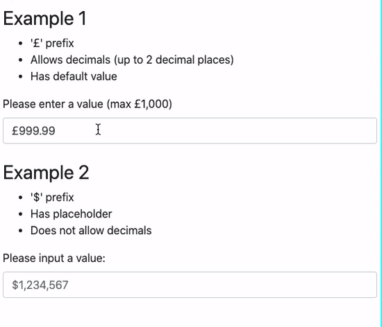

## React Currency Input Field Component

 

Features:

- Only allows numbers
- Automatically inserts commas
- Lightweight and simple
- Works with Bootstrap styling

[Demo](https://cchanxzy.github.io/React-Currency-Input-Field)



### Install

`npm install --save-dev react-currency-input-field`

or

`yarn add -D react-currency-input-field`

### Usage

```
import CurrencyInput from 'react-currency-input-field'

<CurrencyInput
  id="input-example"
  placeholder="£1,000"
  onChange={() => {}}
/>
```

Have a look in [`src/examples`](https://github.com/cchanxzy/React-Currency-Input-Field/tree/master/src/examples) for more examples on implementing.

### Issues

Feel free to message me if you have any questions
